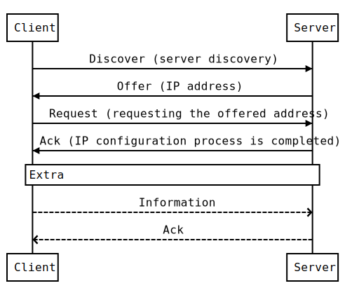

## DHCP client

Based on [DHCProbe](https://github.com/JohannesBuchner/DHCProbe) and [dhcp-client](https://github.com/samueldotj/dhcp-client)

### DHCP details

[WIKI](https://en.wikipedia.org/wiki/Dynamic_Host_Configuration_Protocol)

[RFC2132](https://tools.ietf.org/html/rfc2132)

[RFC1497](https://tools.ietf.org/html/rfc1497)

### Sequence Diagram

### Usage

#./dhcpclient [-c ciaddr] [-g giaddr] [-r reqip] [-s server] [-l loglevel] [-v] -d devname
- -d - network interface
- -c - client ip address
- -g - gateway ip address
- -r - requested ip address
- -s - server ip address
- -l - log level (0 - quiet, 3 - verbose)
- -v - verbose (loglevel = 3)

### Build
$ mkdir build

$ cd build

$ cmake ../

$ make

### Run
#dhcpclient -d eth0

